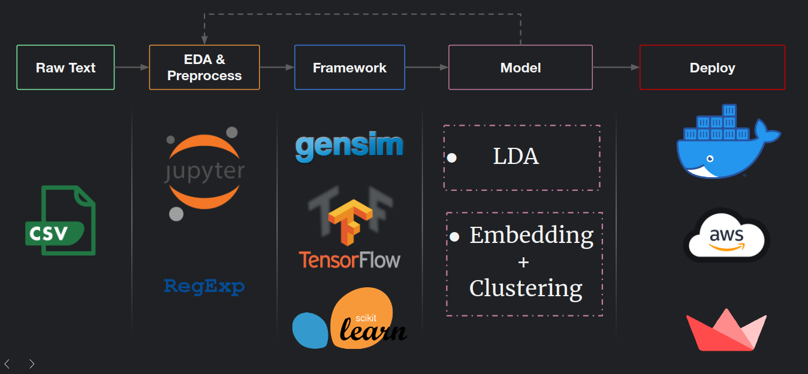

# Topic Identification Pipeline for short texts

### Target text corpus:
 - Reviews
 - Customer complaints
 - Call trnscripts

 This directory will contain base implementation of a topic identification model with attention to context. This will be based on _LDA_ probablisitic topic assignment and pretrained sentence embedding from _BERT_ [1]. 

## Motivation for this pipeline

The nature of Twimintel and the diverse dataset twimintel evnatually will process pushes us to the problem of choosing correct type of approcahes. _This branch will deal with different kind of pipelines and alogorithms used in twimintel_.

As we can see [2] different type of text require us to take different approach to get correct topic out of our pipeline. This branch outlines the first draft of it.

## Motivation

One of the primary data to glean insight from is product reviews. There can be different types of reviews that can include from ecommerce product reviews in sites like amazon.in to digital reviews in steam and also in Zomato.
Most platforms have barely a satisfying categorization system for the reviews when it comes to what the reviewers are really talking about.

This pipeline will provide a topic identification procedure thats combines both bag-of-words and contextual information to explore potential __semantically meaningful__ categories out of the reviews.

## Dataset

#1 :  Steam review dataset for games: https://www.dl.dropboxusercontent.com/s/lp7f9h74ebwnf97/steam_reviews.csv?dl=0

## Architecture 

- Prepare the dataset for consumption using a set of RegEx to normalize the data
- Use EDA to get insight about data distribution and structure
- Implement topic identification models
- Deploy in docker / aws / etc

 [1]: https://arxiv.org/abs/1810.04805
 [2]: https://www.researchgate.net/publication/335339697_A_Detailed_Survey_on_Topic_Modeling_for_Document_and_Short_Text_Data